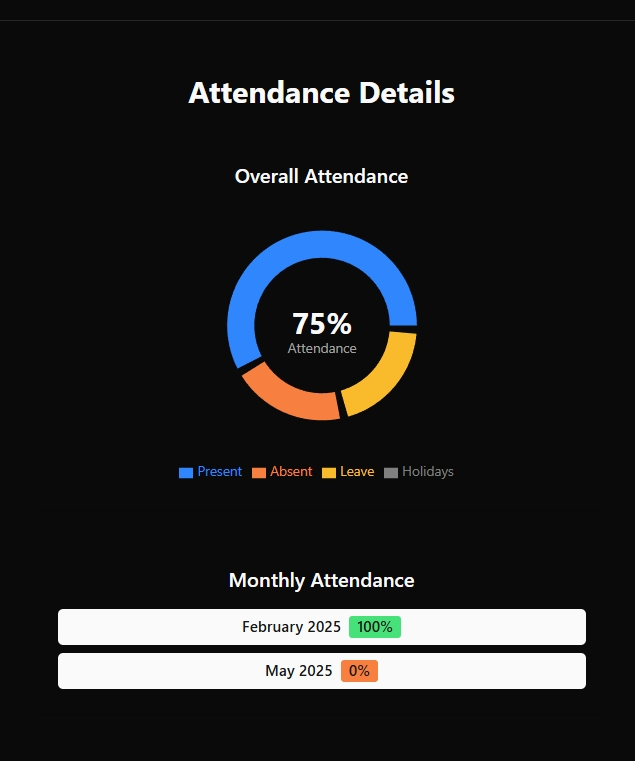
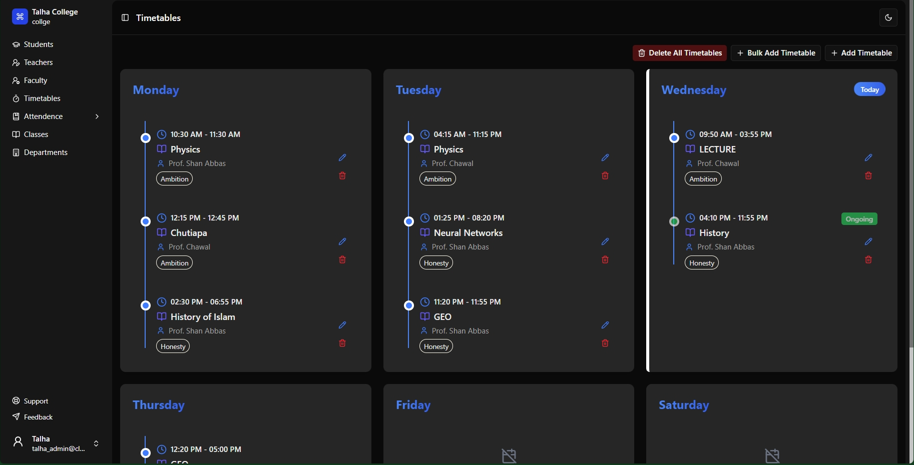
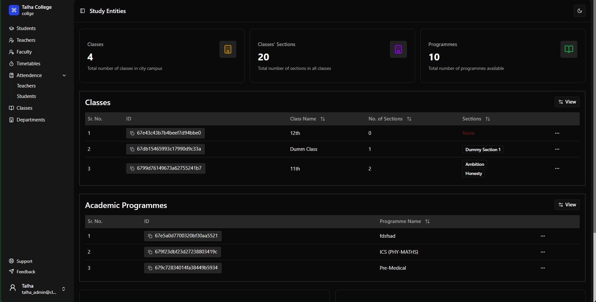
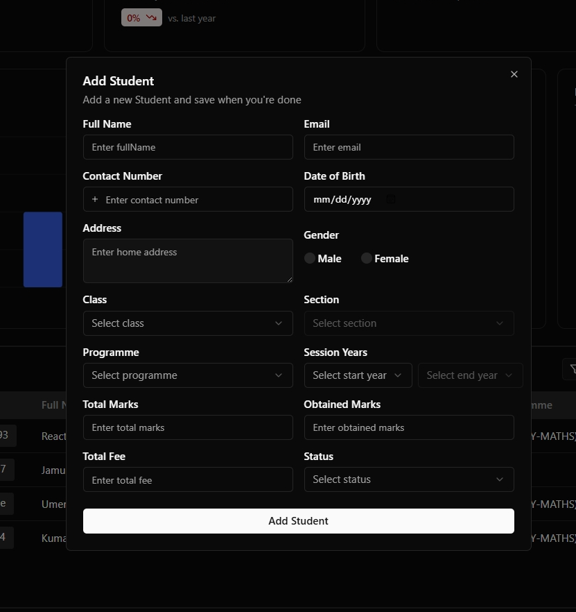
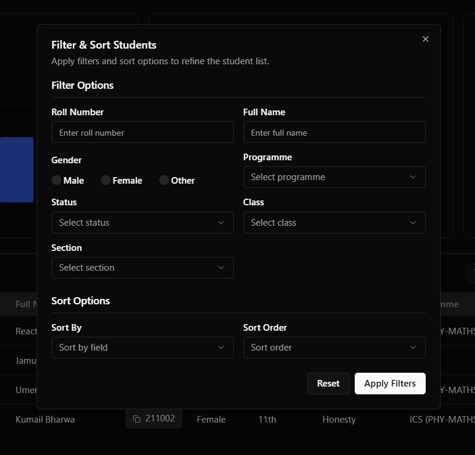
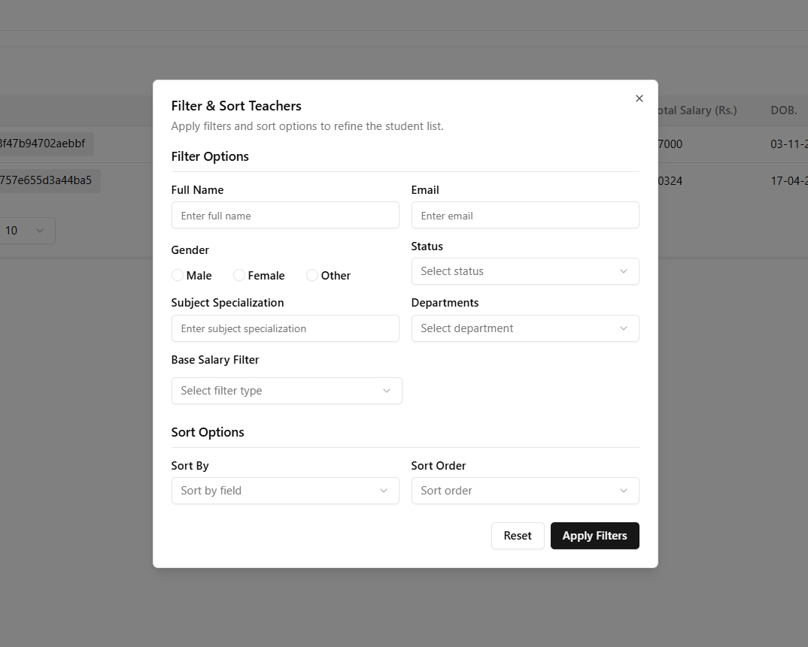

# 🏫 College Management System (Role-Based Access)

A full-stack **College Management System** developed as a **learning and hobby project**. It implements a robust **Role-Based Access Control (RBAC)** model and provides essential features for managing college operations, including attendance, timetables, and organizational hierarchy.

> ⚠️ This is **not** a complete production-ready system. Examination modules and personalized dashboards (homepages) for each role are intentionally omitted for simplicity.

---

## 🚀 Features

### 🔐 Role-Based Access Control (RBAC)
- **Roles:**  
  - `Admin` (Principal)  
  - `Students`  
  - `Teachers`  
  - `Staff Members` (e.g. Clerks, Vice Principal)
- Every route and feature is protected based on role permissions.

---

### 🧑‍🎓 User Management
- Create, update, and delete:
  - **Students**
  - **Teachers**
  - **Staff**
  - **Admins**

---

### 🏫 Academic Structure Management
- Manage core entities like:
  - **Classes**
  - **Departments**
  - **Sections**

---

### 🗓️ Timetable Management
- **Admin** can:
  - Create and assign timetables for students and teachers.
- **Teachers** can:
  - View daily and weekly lecture schedules.
- **Students** can:
  - View their complete timetable.

---

### 📊 Attendance Management with Analytics
- Admins can:
  - Mark **teacher attendance**
- Faculty can:
  - only view **teachers attendance** & **students attendance**
- Teachers:
  - View sections where they have lectures today
  - Mark attendance for students for that sections
- Each user has:
  - A **calendar view** per month
  - **Graphical representation** of attendance data (charts and analytics)

---

### 🧾 Tabular Interfaces for CRUD
- Tabular UI for:
  - Teachers
  - Students
  - Employees (Staff)
  - Departments
  - Sections
  - Classes

---

### ✅ Filters for both Teachers and Students
### ✅ Bulk addition for both students and timetables using spredsheet (.xlsx files)
### ✅ Dark and light theme

---

## 📦 Project Scope

This project is designed for **personal learning and experimentation**. As such, some features have been **intentionally excluded**:

- ❌ **Examination modules**
- ❌ **Individual dashboards/homepages for users**
- ❌ **Advanced reporting or notifications**
- ❌ **Events Managment**

---

## 📌 Goals

- Understand and apply **RBAC** in real-world systems
- Work with complex **structures** (teachers, students, attendances, timetables)
- Build reusable UI components (tables, calendars, charts)
- Explore and implement **attendance analytics** and "timetables tracking"

---

## 🛠️ Tech Stack

### Frontend
- **React (TypeScript)**
- **Tailwind CSS**
- **ShadCN UI**
- **Redux Toolkit + RTK Query**

### Backend
- **Node.js**
- **Express.js**
- **JWT Authentication**
- **Role-Based Access Control** (Admin, Staff, Teacher, Student)
- **Middleware & Utilities:**
  - `express-rate-limit`
  - `lru-cache`
  - `moment`
  - `morgan`
  - `winston`
  - `xlsx-js-style` (for spreadsheet handling)

### State Management & API
- **Redux Toolkit**
- **RTK Query**

### Charts & Visualizations
- **Recharts**
- **ShadCN UI Charts**

### Database
- **MongoDB** (mongoose)

---

## 📸 Screenshots
Below are some screenshots in development mode for fully working application:

### Student Attendance Details

### Timetable Management

### Student Atttendance Details Page

### Academics Managment Page

### Add Student Form

### Students Filter

### Teachers Fitler

---

## 🧪 Setup Instructions
This project is split into two parts: a frontend (React + Vite) and a backend (Node.js + Express). I have added .env.sample file in both frontend and backend folder. Overview of env files are below:

### BACKEND ENV
PORT=8000
MONGODB_URL=<YOUR_MONGODB_URL>
CORS_ORIGIN=http://localhost:5173
NODE_ENV=development

ACCESS_TOKEN_SECRET=OzjZ-W2RQ7t8Oz7vWqg4OtV2mBllfa4hsaf2_Zyh3rMXmBmqjBKv58p23safsfdxKbPZKlpAdS3oOE2tGoRP24FnJ_0hvirp0_uugECE5
ACCESS_TOKEN_EXPIRY=1d
REFRESH_TOKEN_SECRET=aIAzUxBMzrbPwQakGAPN6FNN_e-EaZOoJAIVVAf245z0zHpvumfN_NJKgyYNCffcSOGYas8qgGJCNzS6DN62zx_fzI4fasd5345qadfg
REFRESH_TOKEN_EXPIRY=10d

PASS_HASH_SECRET=myTotalySecretKey

Change MONGODB_URL with your url and you can change all the other variables as you like

### FRONTEND ENV
VITE_BACKEND_ORIGIN=http://localhost:8000
NODE_ENV=development

You can change all the other variables as you like

---

## 📜 License
This project is open-sourced for educational purposes only. You are free to fork, modify, and use parts of it, but please give credit where due.

---
